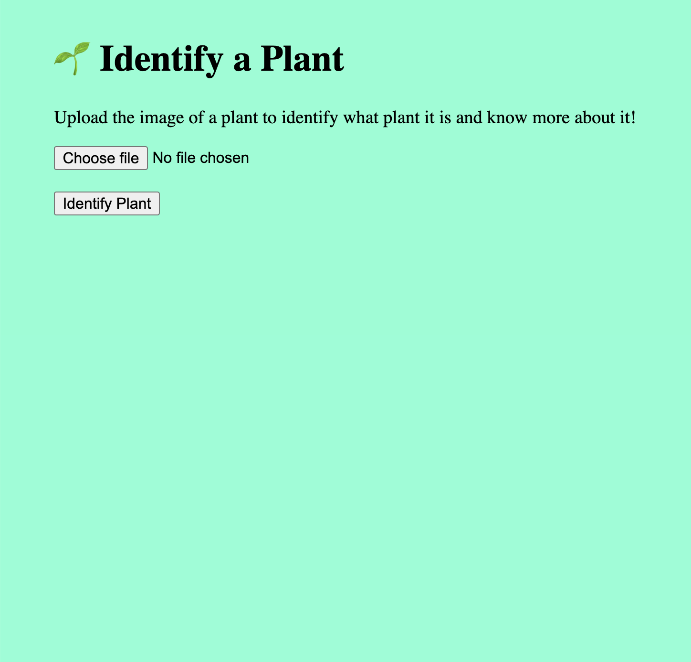
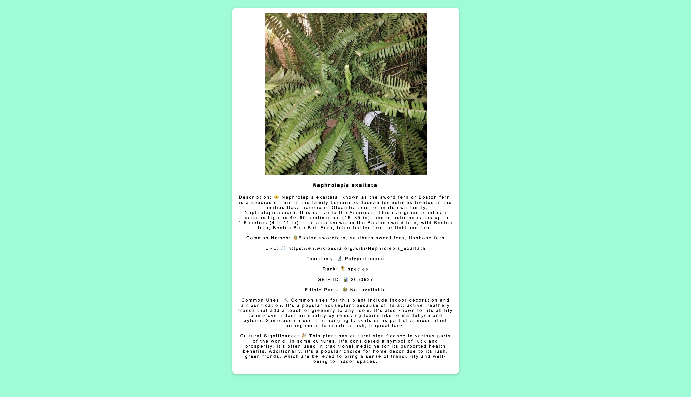

# plant-identification-website
  
A web app that lets users take a picture of a plant and instantly identify it using AI-powered plant recognition. The app generates a flashcard with details like scientific name, cultural significance, edible parts, and more. Powered by the Plant.id API, this tool gamifies plant discovery, making learning about biodiversity fun and engaging! 🌱✨
  
🔹 Features:  
✅ AI-powered plant identification 📷  
✅ Interactive flashcards with fun facts 🌍  
✅ Scientific names, edible parts, and cultural history 🍃  
✅ User-friendly design for nature lovers 🌿  
  
🚀 Built to make plant learning fun and accessible!  
  
Hidden the API key but this is the sample workflow:  
  
1️⃣ User Uploads an Image  
On the homepage, users can upload a plant image to identify it.  
  
  
2️⃣ Image is Processed  
For example, a user uploads this image of a Boston Fern:  
  
  
3️⃣ Flashcard Populates with Information  
After identification, a flashcard appears showing details like the scientific name, cultural significance, and edible parts.  
  
  
⚠️ Important Note  
🚨 This code will NOT work out of the box because the API key has been hidden for security reasons.  
To run the project, you will need to:  
  
Obtain your own API key from Plant.id  
Modify the code to include your API key in API requests in index.js  
